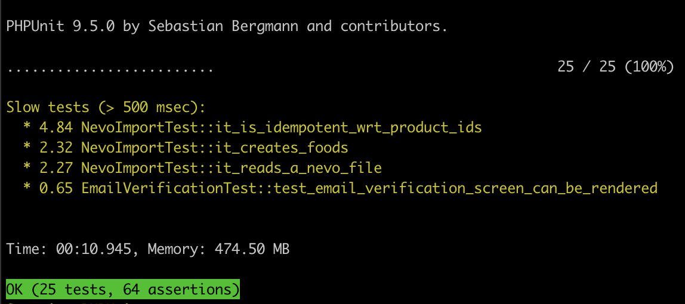

# Simple Slow Test Reporter
> Reports slow tests in your PHPUnit testsuite

[](example.png)

## Requirements
Requires PHPUnit 9.0+

## Installation
Add the reporter as a dev dependency:
```bash
composer require --dev jakobbuis/simple-slow-test-reporter
```

Add the extension to your `phpunit.xml` file as a root-node:
```xml
<phpunit>
    [...]
    <extensions>
        <extension class="SSTR\SlowTestReporter" />
    </extensions>
</phpunit>
```

The default threshold for slow tests is 500 milliseconds. You can configure the
limit in the extension:
```xml
<phpunit>
    [...]
    <extensions>
        <extension class="SSTR\SlowTestReporter">
            <arguments>
                <integer>1000</integer>
            </arguments>
        </extension>
    </extensions>
</phpunit>
```

## License
MIT
